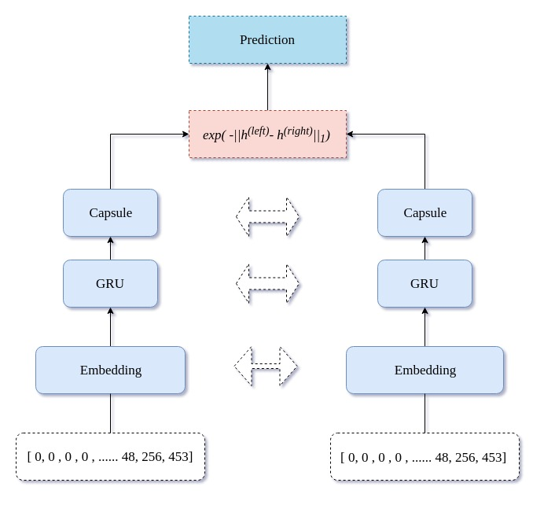

# Siamese-Recurrent-Architectures
Siamese networks are networks that have two or more identical sub-networks in them. Siamese networks seem to perform well on similarity tasks and have been used for tasks like sentence semantic similarity, recognizing forged signatures and many more.
[This](http://www.mit.edu/~jonasm/info/MuellerThyagarajan_AAAI16.pdf) paper offers a pretty straightforward approach to the common problem of sentence similarity using simamese network, named MaLSTM (“Ma” for Manhattan distance)

This project tries to dig deep in to siamese networks to outperform the MALSTM performance. Following architectures have been considered.

----------------------------------------------------------------------------------------------------
### MALSTM (Original Paper)
#### Architecture

The experiments can be found [here](MALSTM.ipynb).
Best result was,

| Optimizer | Transfer Learning| Augmentation|Embedding|RMSE|Pearson|Spearman| 
| ----------|------------------| ------------|---------|----|-------|--------|
| Adagrad  | False | False |word2vec|0.153|0.809|0.741|
| Adadelta✞ | True✞ | True✞| word2vec✞| 0.156✞ |0.802✞|0.733✞

✞denotes the original paper.

-----------------------------------------------------------------------------------------------------
### MAGRU
#### Architecture

The experiments can be found [here](MAGRU.ipynb).
Best result was,

| Optimizer | Transfer Learning| Augmentation|Embedding|RMSE|Pearson|Spearman| 
| ----------|------------------| ------------|---------|----|-------|--------|
| Adadelta  | True | True |word2vec|0.140|0.838|0.780

-----------------------------------------------------------------------------------------------------
### MABILSTM
#### Architecture

The experiments can be found [here](MABILSTM.ipynb).
Best result was,

| Optimizer | Transfer Learning| Augmentation|Embedding|RMSE|Pearson|Spearman| 
| ----------|------------------| ------------|---------|----|-------|--------|
| Adadelta  | True | False |word2vec|0.164|0.784|0.708

-----------------------------------------------------------------------------------------------------
### MABIGRU
#### Architecture

The experiments can be found [here](MABIGRU.ipynb).
Best result was,

| Optimizer | Transfer Learning| Augmentation|Embedding|RMSE|Pearson|Spearman| 
| ----------|------------------| ------------|---------|----|-------|--------|
| Adadelta  | True | True |word2vec|0.143|0.832|0.773

-----------------------------------------------------------------------------------------------------
### MALSTM-ATTENTION
#### Architecture

The experiments can be found [here](MALSTM-ATTENTION.ipynb).
Best result was,

| Optimizer | Transfer Learning| Augmentation|Embedding|RMSE|Pearson|Spearman| 
| ----------|------------------| ------------|---------|----|-------|--------|
| Adagrad  | False | False |word2vec|0.145|0.827|0.765

-----------------------------------------------------------------------------------------------------
### MAGRU-ATTENTION
#### Architecture

The experiments can be found [here](MAGRU-ATTENTION.ipynb).
Best result was, 

| Optimizer | Transfer Learning| Augmentation|Embedding|RMSE|Pearson|Spearman| 
| ----------|------------------| ------------|---------|----|-------|--------|
| Adadelta  | False | False |word2vec|0.149|0.818|0.751

-----------------------------------------------------------------------------------------------------
### MAGRU-CAPSULE
#### Architecture

The experiments can be found [here](MAGRU-CAPSULE.ipynb).
Best result was, 

| Optimizer | Transfer Learning| Augmentation|Embedding|RMSE|Pearson|Spearman| 
| ----------|------------------| ------------|---------|----|-------|--------|
| Adadelta  | False | False |word2vec|0.156|0.806|0.733

